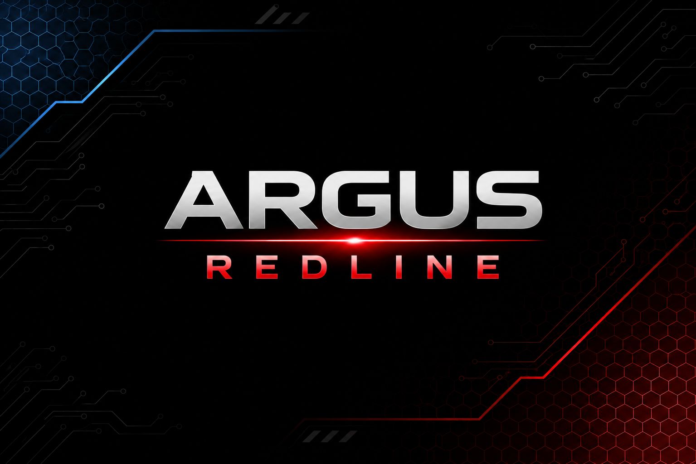

<p align="center">
  
</p>

# ARGUS REDLINE

**Open-source off-grid IoT, system security, and structured communications over resilient low-bandwidth radio.**

## Connected Devices When the Grid Goes Down

ARGUS REDLINE is an open-source, off-grid network platform designed to connect computers, smartphones, sensors, devices, and field infrastructure when Wi-Fi, cellular service, and the internet aren't available.

Small, inexpensive radio nodes carry alerts, sensor readings, status updates, commands, and application data across resilient, long-range links without depending on commercial infrastructure.

Think remote property, farms, disaster response, community networks, field research, expeditions, events, mobile operations, or anywhere devices need to communicate beyond normal network coverage.

**One radio network. Whatever application you want to build on top of it.**

## The Architecture

REDLINE is built around a single, clean rule:

**The radio layer moves information reliably and safely. The application decides what that information means.**

```text
   [ Your Application ]
            |
            v
  [ Host Computer / Phone ]
            |
            v
     [ REDLINE Hub ]
            |
            v
 [ Off-Grid Radio Network ]
            |
            v
    [ REDLINE Node ]
            |
            v
[ Sensors / Field Devices ]
```

* **The Application Layer:** Your computer or smartphone handles the intelligence — user interfaces, mapping, databases, analytics, automation, operator interfaces, and business logic — without putting application-specific logic on the radio microcontroller.
* **The Infrastructure Layer:** REDLINE provides the physical bridge and owns constrained communications, device identity, bounded transactions, local runtime behavior, and radio transport between the host and field hardware. It packages data into small, efficient radio messages designed for long-range, low-bandwidth links where conventional network coverage may not exist.
* **The Field Layer:** Remote Nodes connect to independently provisioned field hardware and expose approved logical capabilities representing sensors, indicators, controls, storage, location providers, local procedures, and other physical interfaces rather than unrestricted raw GPIO or hardware-specific implementation details.

## What You Can Build On Top of It

Because REDLINE provides a shared off-grid network, completely different software systems can use the same underlying infrastructure.

* **Private Off-Grid Messaging:** Build encrypted local communications networks for families, neighborhood groups, or field teams to text and coordinate during emergencies.
* **Remote Sensor Networks:** Track environmental conditions, soil moisture, water levels, weather, solar systems, or equipment diagnostics across large areas.
* **Equipment Telemetry & Control:** Monitor distributed machinery, activate indicators, trigger equipment, or manage localized automation without cellular subscriptions.
* **Field Logistics & Operations:** Build location tracking, team check-ins, status reporting, panic/duress signaling, and coordination tools for expeditions, events, and remote operations.
* **Resilient Routing:** Extend coverage through repeaters, store-and-forward networking, and distributed routing to work around distance, terrain, and infrastructure gaps.

## One Substrate. Many Applications.

Most radio systems are built around one specific job. ARGUS REDLINE takes a different approach.

The network provides a common connection between computers and the physical world while applications decide what that connection is used for.

A REDLINE network can carry a weather reading, a check-in message, a location update, an equipment alert, a sensor measurement, a remote command, or data for an application that hasn't been invented yet.

The same underlying network can support entirely different tools without rebuilding the radio infrastructure for every new idea — and without turning the microcontroller firmware into a collection of application-specific features.

The goal is simple:

**You build the application. REDLINE provides the network.**

## Development Status

ARGUS REDLINE is an experimental embedded communications and device-control platform developed by **RaveGoat Labs** for the wider **RG Herd** coordination ecosystem.

> **Firmware release:** `v0.6.0` — Structured Operations, Responses, and Host Protocol.

**Current release:** v0.6.0. The milestone adds developmental Host Protocol 0.1, structured REDLINE operations, Wire Protocol 1 RESPONSE completion semantics, bounded Host request lifecycle and retained-result replay, and complete computer-to-Hub-to-Node-to-computer structured operation flow.

Current lifecycle authorities are:

```text
Firmware release        v0.6.0
Host Protocol           0.1
Wire Protocol           1
Configuration Schema    1
Hardware profile        HELTEC_V4
```

The production framework is Arduino-ESP32 3.3.9 / ESP-IDF 5.5.4 through pioarduino platform 55.3.39. Complete two-board physical qualification passed after investigation of the earlier Arduino-ESP32 2.0.17 USB/HWCDC Host-response delivery failure and migration to the accepted framework generation.

Wire Protocol 1 remains unauthenticated and unencrypted. Production unauthenticated RF authority is deliberately restricted; structured SET or procedure operations do not grant general remote side-effect authority.

The next planned milestone is `v0.7.0 — Node-Originated Events and Reliable Delivery`.

### Project Documentation

* **[ARGUS REDLINE — What It Is](docs/PROJECT_OVERVIEW.md)** — system purpose and broad development direction
* **[Versioned Development Roadmap](docs/ARGUS_REDLINE_VERSIONED_DEVELOPMENT_ROADMAP.md)** — authoritative release order, milestone scope, and release gates
* **[Host Transport Architecture](docs/ARGUS_REDLINE_HOST_TRANSPORT_ARCHITECTURE.md)** — responsibility boundaries between applications, host services, Hub firmware, and radio transport
* **[v0.6.0 Architecture Baseline](docs/V0.6.0_ARCHITECTURE_BASELINE.md)** — pre-implementation architectural baseline
* **[Host Protocol 0.1](docs/HOST_PROTOCOL_0.1.md)** — developmental computer-to-device protocol
* **[v0.6.0 Wire Operation and Response Design](docs/V0.6.0_WIRE_OPERATION_RESPONSE_DESIGN.md)** — structured radio operations and response semantics
* **[v0.6.0 Implementation Brief](docs/V0.6.0_IMPLEMENTATION_BRIEF.md)** — implementation sequence and acceptance gates
* **[v0.6.0 Physical Qualification Results](docs/V0.6.0_PHYSICAL_QUALIFICATION_RESULTS.md)** — complete physical qualification and framework-migration evidence
* **[v0.6.0 Release Notes](docs/V0.6.0_RELEASE_NOTES.md)** — release scope, compatibility, validation, and limitations
* **[v0.6.0 Dependency and Source Audit](docs/V0.6.0_DEPENDENCY_AND_SOURCE_AUDIT.md)** — production framework, dependency, and source authority
* **[August 14 Security Review](docs/ARGUS_REDLINE_SECURITY_REVIEW_2026-08-14.md)** — security findings and current dispositions
* **[v0.5.1 Implementation and Qualification Brief](docs/V0.5.1_IMPLEMENTATION_AND_QUALIFICATION_BRIEF.md)** — F-01 correction and acceptance gates
* **[v0.5.1 Qualification Results](docs/V0.5.1_QUALIFICATION_RESULTS.md)** — physical qualification evidence
* **[v0.5.1 Hardware Qualification Follow-up](docs/V0.5.1_HARDWARE_QUALIFICATION_RESULTS.md)** — August 16 GPIO4 ADC and post-characterization radio evidence
* **[v0.5.1 Dependency and Source Audit](docs/V0.5.1_DEPENDENCY_AND_SOURCE_AUDIT.md)** — dependency and source verification
* **[v0.5.1 Development Handoff](docs/ARGUS_REDLINE_v0.5.1_Development_Handoff.md)** — patch, compatibility, validation, and remaining limitations

## Implemented now

ARGUS REDLINE v0.6.0 provides:

* Two independently buildable Heltec V4 Hub and Node firmware roles
* Bidirectional SX1262 LoRa communication at 915 MHz
* Wire Protocol 1 with explicit addressing, sequence matching, bounded retries, canonical duplicate suppression, ACK admission, and structured RESPONSE completion
* Preservation of the autonomous legacy `TEST=0x64` transaction
* Hardware-independent runtime state and bounded diagnostics
* Deterministic GPIO0 input and shared nonblocking OLED interface
* Configuration Schema 1 persistent settings with bounded dual-slot recovery and factory reset
* A bounded immutable logical capability registry with typed values/results, authorization, interlocks, diagnostics, and role-safe dispatch
* HELTEC_V4 indicator `0x0101`, digital input `0x0201`, and fail-closed analog capability `0x0301`
* Developmental Host Protocol 0.1 over bounded COBS-framed USB CDC with CRC validation and malformed-frame recovery
* HELLO negotiation reporting firmware, Host Protocol, Wire Protocol, Configuration Schema, hardware profile, role, device ID, categories, features, and bounded operation capacity independently
* Structured operations: `PING`, `GET_DEVICE_INFO`, `GET_STATUS`, `GET_CAPABILITIES`, `DESCRIBE_CAPABILITY`, `READ_CAPABILITY`, `SET_INDICATOR`, `RUN_PROCEDURE`, and `GET_DIAGNOSTICS`
* One active Host operation plus one fixed retained completion with exact replay, `BUSY`, `MISMATCH`, replacement, and reconnect semantics
* A bounded Hub radio bridge mapping an accepted Host request to a structured Wire transaction and correlated Host response
* Separate ACK admission and RESPONSE operation-completion semantics
* Bounded Host Protocol diagnostics independent of radio and capability diagnostics
* A deterministic Python Host reference/test utility
* Complete two-board physical validation of Host Protocol, structured radio operations, retained-result lifecycle, authorization denial, physical input/output behavior, OLED/radio coexistence, settings persistence, reconnect behavior, and Host-absent legacy radio operation

Production remote authority remains intentionally restricted because Wire Protocol 1 does not authenticate RF peers. Current traffic is structured and validated but is **not cryptographically authenticated or encrypted**.

## Project

Developed by [RaveGoat Labs](https://ravegoat.com/) as part of the [RG Herd](https://rgherd.com/) privacy-first communications and coordination ecosystem.

Learn more about the ARGUS coordination platform at [argus.rgherd.com](https://argus.rgherd.com/).

Related public projects:

* [ARGUS](https://github.com/sudorgherd/rgherd-argus) — self-hosted dispatcher and operator coordination platform
* [RG Herd](https://rgherd.com/) — privacy-first communications and coordination infrastructure
* [ARGUS REDLINE v0.1.0](https://github.com/sudorgherd/argus-redline/releases/tag/v0.1.0) — first published radio protocol release

## Hardware

Current development hardware:

* 2× Heltec WiFi LoRa 32 V4
* ESP32-S3
* Semtech SX1262 LoRa radio
* 915 MHz configuration
* Integrated OLED display
* USB serial debugging

Current logical device roles:

| Role | Device ID |
| ---- | --------: |
| Hub  |    `0x01` |
| Node |    `0x10` |

The current Heltec development hardware is the reference platform, not the intended limit of the REDLINE architecture. Logical capability abstraction is designed to keep higher-level applications independent of raw hardware-specific GPIO assignments.

## Protocol v0.1 wire format

Packets use a six-byte header followed by an optional payload.

Protocol v0.1 identifies the original wire-format lineage. Firmware v0.6.0 remains on Wire Protocol version 1; v0.6.0 extends Wire Protocol 1 additively without changing the existing six-byte header or 32-byte maximum packet geometry. The v0.1.03 tag is preserved as historical release metadata.

| Byte | Field                            |
| ---: | -------------------------------- |
|    0 | Protocol version and packet type |
|    1 | Source device ID                 |
|    2 | Destination device ID            |
|    3 | Sequence number                  |
|    4 | Opcode                           |
|    5 | Payload length                   |
|   6+ | Payload                          |

Maximum packet size is currently 32 bytes.

The codec recognizes these packet types:

* `COMMAND`
* `ACK`
* `ERROR`
* `RESPONSE`

v0.6.0 actively uses `COMMAND`, `ACK`, and `RESPONSE`. ACK represents transaction admission or rejection; RESPONSE carries completion of an accepted structured operation. `ERROR` remains recognized by the codec but is not the active structured-operation completion mechanism.

Protocol definitions and encoding logic are located in [`include/protocol.h`](include/protocol.h).

## Build

Build both firmware environments:

```powershell
platformio run
```

Build individually:

```powershell
platformio run -e tx
platformio run -e rx
```

Upload individually:

```powershell
platformio run -e tx -t upload
platformio run -e rx -t upload
```

Upload ports may need to be changed in `platformio.ini`.

## Local validation

Run the complete native Unity suite:

```powershell
platformio test -e native
```

Build the production Hub and Node firmware:

```powershell
platformio run -e tx
platformio run -e rx
```

Build the two valid device-configuration fixtures:

```powershell
platformio run -e config_hub_valid
platformio run -e config_node_valid
```

The three negative fixtures must fail compilation. A nonzero exit is the expected successful test result; verify the corresponding exact diagnostic shown below:

```powershell
platformio run -e config_missing_local # ARGUS_LOCAL_DEVICE_ID must be defined by the build environment
platformio run -e config_missing_peer  # ARGUS_PEER_DEVICE_ID must be defined by the build environment
platformio run -e config_equal_ids     # Local and peer device IDs must be different
```

## Development history

This repository intentionally preserves its branches, tags, and commit history.

`main` is the primary branch. Temporary development and documentation branches may exist, so this document does not maintain a branch inventory.

The first published radio protocol release remains:

* [ARGUS REDLINE v0.1.0](https://github.com/sudorgherd/argus-redline/releases/tag/v0.1.0)

The firmware identifier in the source is v0.6.0. The historical v0.1.03 tag is preserved, and current firmware retains Wire Protocol 1 compatibility.

The history includes the original string-based exchange, binary protocol implementation, reliability testing, device runtime and UI work, persistent settings, the bounded capability abstraction introduced through v0.5.0, the focused v0.5.1 duplicate-cache correction, and the v0.6.0 structured-operation, RESPONSE, Host Protocol, and framework-migration milestone.

## Development direction

The product architecture described above is being implemented as a layered system in which applications interact with a stable, application-neutral host boundary rather than directly managing embedded transport details.

At the technical level, the intended direction is:

```text
Host applications
      ↓
Application-neutral REDLINE host service / driver
      ↓
Host Protocol
      ↓
REDLINE Hub firmware
      ↓
Wire Protocol
      ↓
Remote REDLINE Nodes
      ↓
Approved physical capabilities
```

Application meaning remains above this boundary.

The embedded layer is responsible for bounded communication and physical capability access. Host-side software remains responsible for business logic, user interfaces, databases, analytics, automation, integrations, and interpretation of the information being transported.

Current v0.6.0 firmware implements the developmental computer-facing Host Protocol 0.1 boundary and structured `COMMAND` / `ACK` / `RESPONSE` radio operations while preserving this separation of responsibilities. The stable multi-client host-service/API lifecycle remains a later milestone.

General opaque application payload transport is planned for v1.1 and is not implemented today.

See **[Host Transport Architecture](docs/ARGUS_REDLINE_HOST_TRANSPORT_ARCHITECTURE.md)** for the stable responsibility boundaries and **[Host Protocol 0.1](docs/HOST_PROTOCOL_0.1.md)** for the developmental v0.6 framing specification.

The next planned milestone is **`v0.7.0 — Node-Originated Events and Reliable Delivery`**.

v0.7.0 builds on the completed v0.6.0 structured-operation and Host Protocol foundation by allowing Nodes to originate structured traffic and preserve important events through temporary Hub unavailability. Persistent identity, authenticated transport, multi-Node networking, repeaters, routing, and mesh remain later milestones.

### V1 target

* Reliable radio transport with structured responses and events, duplicate suppression, and per-device transaction statistics
* Multiple directly reachable Nodes with persistent identities, controlled provisioning, and per-Node state
* A usable device interface with local screens, button input, persistent settings, and clear status feedback
* Initial commands and events including `PING`, `GET_DEVICE_INFO`, `GET_STATUS`, `SET_INDICATOR`, and `REPORT_EVENT`
* A documented computer-facing Hub interface with registry, transaction, capability, and configuration visibility
* Authenticated encryption, persistent counters, replay rejection, credential rotation, device revocation, and recovery after missed updates

These bullets describe complete v1 targets. Some radio-transport foundations are implemented now, but the listed v1 capabilities are not complete.

Persistent ordinary device settings, the bounded capability foundation, structured operations/responses, and developmental Host Protocol 0.1 are implemented through v0.6.0.

Persistent identity, multi-Node coordination, repeaters, routing, store-and-forward, encryption and authentication, replay protection, provisioning, stable host/dispatcher integration, production alerts/check-ins, location sharing, panic/duress workflows, and sensor applications are not implemented.

### Exploratory and later concepts

* Device profiles for handheld, vehicle, sensor, actuator, and stationary roles
* Parameterized operations, policies, stored procedures, and compact workflow definitions
* Emergency signaling and operator check-ins
* Store-and-forward messaging
* Repeaters and mobile relay Nodes
* GNSS and sensor telemetry
* Detachable field modules and third-party hardware profiles
* Application-neutral host SDKs and adapters
* Full ARGUS operator-interface integration

These ideas may be explored where concrete requirements justify them. Their inclusion here is not a commitment to implement them in v1 or afterward, and they are not currently operational features.

## Security

The protocol and firmware are intended to remain open. Operational credentials are not.

Network keys, enrollment secrets, signing keys, access tokens, device certificates, deployment records, and private configuration files must never be committed.

REDLINE is not intended to provide arbitrary remote code execution or unrestricted GPIO access.

Remote embedded device operations must remain limited to operations authorized for the current trust context and approved device capabilities. Wire Protocol 1 radio peers are not authenticated; the v0.6 production design therefore permits only documented read-only/non-side-effecting REMOTE operations according to policy and does not grant general remote `SET_INDICATOR` or `RUN_PROCEDURE` authority. This device-execution restriction does not prohibit the future application-neutral opaque transport layer.

The current firmware does not yet implement the authenticated encrypted transport planned for the v1 development path.

## Experimental status

ARGUS REDLINE is active experimental firmware.

It has not been independently audited and should not currently be relied upon for life-safety or other safety-critical communications.

Radio regulations, permitted frequencies, transmission-power limits, and operating requirements remain the responsibility of the operator.

## License

ARGUS REDLINE is licensed under the **GNU General Public License, version 3 or any later version** (`GPL-3.0-or-later`).

See [`LICENSE`](LICENSE) for the full license text.
